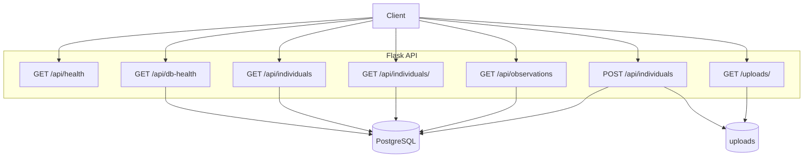

```mermaid
flowchart TB
    Client["Client"]

    subgraph Flask["Flask API"]
        Health["GET /api/health"]
        DBHealth["GET /api/db-health"]
        Individuals["GET /api/individuals"]
        Individual["GET /api/individuals/<id>"]
        Observations["GET /api/observations"]
        Create["POST /api/individuals"]
        Upload["GET /uploads/<filename>"]
    end

    DB[("PostgreSQL")]
    Storage[("uploads")]

    Client --> Health
    Client --> DBHealth
    Client --> Individuals
    Client --> Individual
    Client --> Observations
    Client --> Create
    Client --> Upload

    Individuals --> DB
    Individual --> DB
    Observations --> DB
    Create --> DB
    Create --> Storage
    Upload --> Storage
    DBHealth --> DB
```