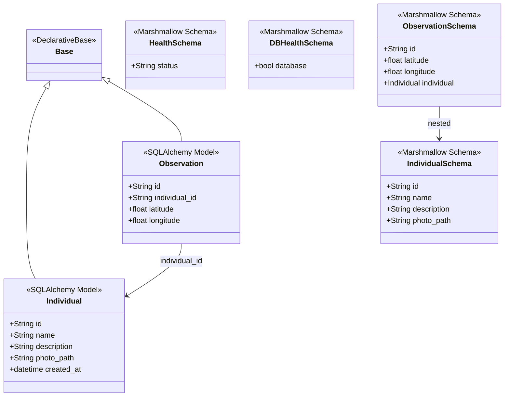

```mermaid
classDiagram
    class Base {
        <<DeclarativeBase>>
    }

    class Individual {
        <<SQLAlchemy Model>>
        +String id
        +String name
        +String description
        +String photo_path
        +datetime created_at
    }

    class Observation {
        <<SQLAlchemy Model>>
        +String id
        +String individual_id
        +float latitude
        +float longitude
    }

    class HealthSchema {
        <<Marshmallow Schema>>
        +String status
    }

    class DBHealthSchema {
        <<Marshmallow Schema>>
        +bool database
    }

    class IndividualSchema {
        <<Marshmallow Schema>>
        +String id
        +String name
        +String description
        +String photo_path
    }

    class ObservationSchema {
        <<Marshmallow Schema>>
        +String id
        +float latitude
        +float longitude
        +Individual individual
    }

    Base <|-- Individual
    Base <|-- Observation

    Observation --> Individual : individual_id
    ObservationSchema --> IndividualSchema : nested
```