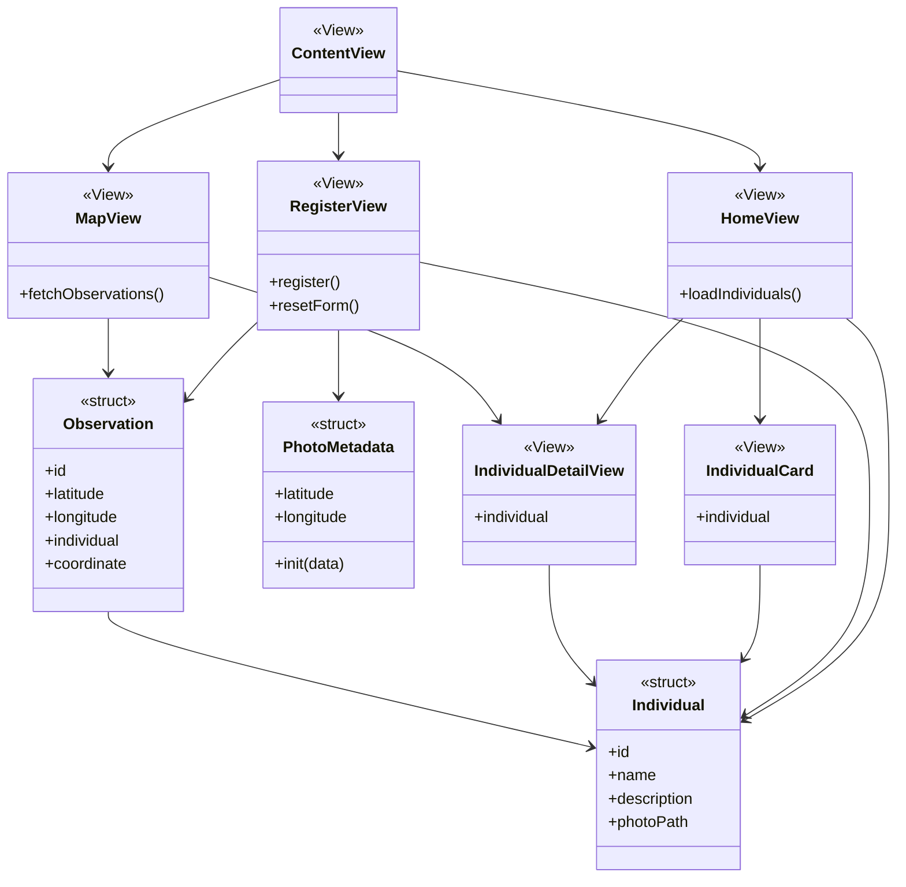

```mermaid
classDiagram
    class Individual {
        <<struct>>
        +id
        +name
        +description
        +photoPath
    }

    class Observation {
        <<struct>>
        +id
        +latitude
        +longitude
        +individual
        +coordinate
    }

    class PhotoMetadata {
        <<struct>>
        +latitude
        +longitude
        +init(data)
    }

    class ContentView {
        <<View>>
    }

    class HomeView {
        <<View>>
        +loadIndividuals()
    }

    class RegisterView {
        <<View>>
        +register()
        +resetForm()
    }

    class IndividualDetailView {
        <<View>>
        +individual
    }

    class MapView {
        <<View>>
        +fetchObservations()
    }

    class IndividualCard {
        <<View>>
        +individual
    }

    ContentView --> HomeView
    ContentView --> RegisterView
    ContentView --> MapView

    HomeView --> Individual
    HomeView --> IndividualCard
    HomeView --> IndividualDetailView

    RegisterView --> Individual
    RegisterView --> Observation
    RegisterView --> PhotoMetadata

    MapView --> Observation
    MapView --> IndividualDetailView

    IndividualCard --> Individual
    IndividualDetailView --> Individual
    Observation --> Individual
```