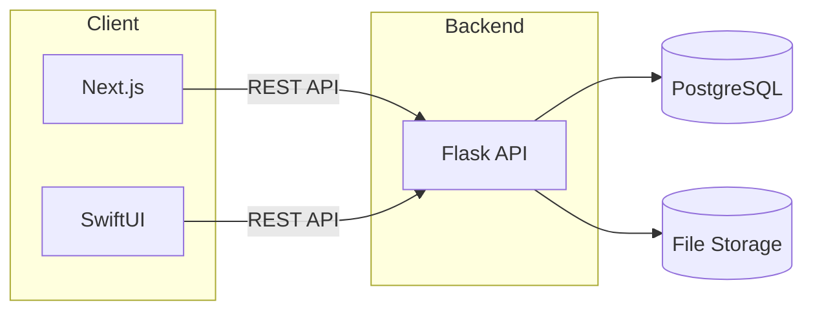

```mermaid
flowchart LR
    subgraph Client
        Next["Next.js"]
        Swift["SwiftUI"]
    end

    subgraph Backend
        Flask["Flask API"]
    end

    DB[("PostgreSQL")]
    Storage[("File Storage")]

    Next -->|REST API| Flask
    Swift -->|REST API| Flask
    Flask --> DB
    Flask --> Storage
```