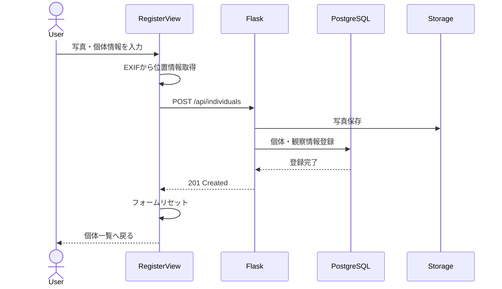

```mermaid
sequenceDiagram
    actor User
    participant RegisterView
    participant Flask
    participant PostgreSQL
    participant Storage

    User->>RegisterView: 写真・個体情報を入力
    RegisterView->>RegisterView: EXIFから位置情報取得
    RegisterView->>Flask: POST /api/individuals
    Flask->>Storage: 写真保存
    Flask->>PostgreSQL: 個体・観察情報登録
    PostgreSQL-->>Flask: 登録完了
    Flask-->>RegisterView: 201 Created
    RegisterView->>RegisterView: フォームリセット
    RegisterView-->>User: 個体一覧へ戻る
```