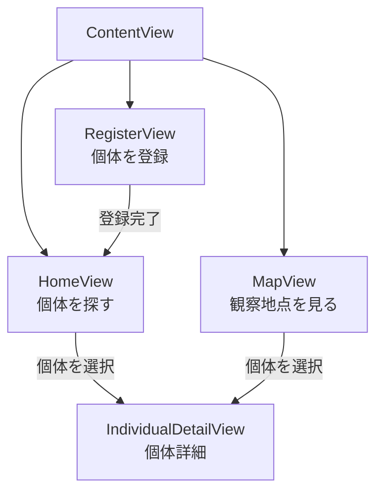

```mermaid
flowchart TD
    Content["ContentView"]

    Home["HomeView\n個体を探す"]
    Register["RegisterView\n個体を登録"]
    Map["MapView\n観察地点を見る"]

    Detail["IndividualDetailView\n個体詳細"]

    Content --> Home
    Content --> Register
    Content --> Map

    Home -->|"個体を選択"| Detail
    Map -->|"個体を選択"| Detail

    Register -->|"登録完了"| Home
```